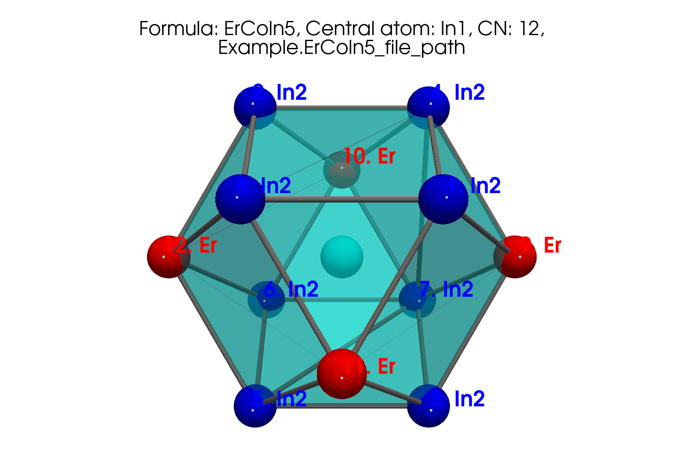
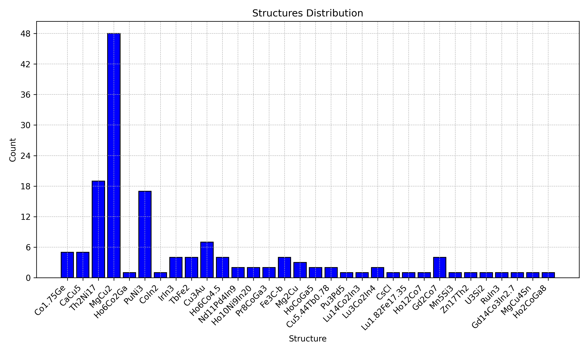

# Getting started

## Statement of need

`cifkit` uses .cif files by offering higher-level functions and variables that
enable users to perform complex tasks efficiently with a few lines of code.
`cifkit` distinguishes itself from existing libraries by offering higher-level
functions and variables that allow solid-state synthesists to obtain intuitive
and measurable properties impactful properties. It facilitates the visualization
of coordination geometry from each site using four coordination determination
methods and extracts physics-based features like volume and packing
efficiency—crucial for structural analysis in machine learning tasks. Moreover,
`cifkit` extracts atomic mixing information at the bond pair level, tasks that
would otherwise require extensive manual effort using GUI-based tools like
VESTA, Diamond, and CrystalMaker.

`cifkit` further enhances its utility by providing functions for sorting,
preprocessing, and analyzing the distribution of underlying CIF files. It
systematically addresses common issues in CIF files from databases, such as
incorrect loop values and missing fractional coordinates, by standardizing and
filtering out ill-formatted files. The package also preprocesses atomic site
labels, transforming labels like 'M1' to 'Fe1' in files with atomic mixing for
improved visualization and pattern matching. Beyond error correction, `cifkit`
offers functionalities to copy, move, and sort files based on attributes such as
coordination numbers, space groups, unit cells, and shortest distances. It
excels in visualizing and cataloging CIF files, organizing them by supercell
size, tags, coordination numbers, elements, and atomic mixing.

## TL;DR

`cifkit` provides higher-level functions in just a few lines of code.

- **Coordination geometry** - `cifkit` provides functions for visualing
  coordination geometry from each site and extracts physics-based features like
  volume and packing efficiency in each polyhedron.
- **Atomic mixing** - `cifkit` extracts atomic mixing information at the bond
  pair level—tasks that would otherwise require extensive manual effort using
  GUI-based tools like VESTA, Diamond, and CrystalMaker.
- **Filter** - `cifkit` offers features for preprocessing. It systematically
  addresses common issues in CIF files from databases, such as incorrect loop
  values and missing fractional coordinates, by standardizing and filtering out
  ill-formatted files. It also preprocesses atomic site labels, transforming
  labels such as 'M1' to 'Fe1' in files with atomic mixing.
- **Sort** - `cifkit` allows you to copy, move, and sort `.cif` files based on
  attributes such as coordination numbers, space groups, unit cells, shortest
  distances, elements, and more.

## Processing speed expectation

Processing approximately 10,000 .cif files on a standard laptop (iMac with M1
chip) may take about 30 to 60 minutes. At this rate, we can process nearly all
.cif files within 1–2 days.

## Installation

Python 3.10, 3.11, 3.12 are supported.


[](https://pypi.python.org/pypi/cifkit)
[](https://anaconda.org/conda-forge/cifkit)

pip install

```bash
pip install cifkit
```

## Overview

`cifkit` provide two primary classes: `Cif` and `CifEnsemble`.

### Cif

`Cif` is initialized with a `.cif` file path. It parses the `.cif` file,
generates supercells, and computes nearest neighbors. It also determines
coordination numbers using four different methods and generates polyhedrons for
each site.

The example below uses `cifkit` to visualize the polyhedron generated from each
atomic site based on the coordination number geometry.

```python
from cifkit import Cif

cif = Cif("your_cif_file_path")
site_labels = cif.site_labels

# Loop through each site label
for label in site_labels:
    # Dipslay each polyhedron, .png saved for each label
    cif.plot_polyhedron(label, is_displayed=True)
```



For more, visit
[https://bobleesj.github.io/cifkit/notebooks/01_cif](https://bobleesj.github.io/cifkit/notebooks/01_cif)
for a full tutorial with an interactive Google Codelab link.

### CifEnsemble

`CifEnsemble` is initialized with a folder path containing `.cif` files. It
identifies unique attributes, such as space groups and elements, across the
`.cif` files, moves and copies files based on these attributes. It generates
histograms for all attributes.

The following example generates a distribution of structure.

```python
from cifkit import CifEnsemble

ensemble = CifEnsemble("your_cif_containing_folder_path")
ensemble.generate_structure_histogram()
```



Basde on your visual histogram above, you can copy and move .cif files based on
specific attributes:

```python
# Return file paths matching structures either Co1.75Ge or CoIn2
ensemble.filter_by_structures(["Co1.75Ge", "CoIn2"])

# Return file path matching CeAl2Ga2
ensemble.filter_by_structures("CeAl2Ga2")
```

For more, visit
[https://bobleesj.github.io/cifkit/notebooks/02_cif_ensemble/](https://bobleesj.github.io/cifkit/notebooks/02_cif_ensemble/)
for a full tutorial with an interactive Google Codelab link.

## Research projects using `cifkit`

The below projects uses the `Cif` and `CifEnsemble` classes for research
applications.

- CIF Bond Analyzer (CBA) - extract and visualize bonding patterns -
  [DOI](https://doi.org/10.1016/j.jallcom.2023.173241) |
  [GitHub](https://github.com/bobleesj/cif-bond-analyzer) |
  [Poster](https://bobleesj.github.io/files/presentation/2024-GRC-poster.pdf)
- Structure Analysis/Featurizer (SAF) - build geometric features for binary,
  ternary compounds -
  [GitHub](https://github.com/bobleesj/structure-analyzer-featurizer)
- CIF Cleaner - move, copy .cif files based on attributes
  [GitHub](https://github.com/bobleesj/cif-cleaner)

## How to ask for help

`cifkit` is also designed for experimental materials scientists and chemists.

- If you have any issues or questions, please feel free to reach out to Bob Lee
  [@bobleesj](https://github.com/bobleesj) or
  [leave an issue](https://github.com/bobleesj/cifkit/issues).

## How to contribute to `cifkit`

Here is how you can contribute to the `cifkit` project if you found it helpful:

- Star the repository on GitHub and recommend it to your colleagues who might
  find `cifkit` helpful as well.
  [](https://github.com/bobleesj/cifkit/stargazers)
- Create a new issue for any bugs or feature requests
  [here](https://github.com/bobleesj/cifkit/issues)
- Fork the repository and consider contributing changes via a pull request.
  [](https://github.com/bobleesj/cifkit/fork).
  Check out
  [CONTRIBUTING.md](https://github.com/bobleesj/cifkit/blob/main/CONTRIBUTING.md)
  for instructions.
- If you have any suggestions or need further clarification on how to use
  `cifkit`, please reach out to Bob Lee
  ([@bobleesj](https://github.com/bobleesj)).

## Contributors

`cifkit` has been greatly enhanced thanks to the contributions from a diverse
group of researchers:

- Anton Oliynyk: original ideation with `.cif` files
- Alex Vtorov: tool recommendation for polyhedron visualization
- Danila Shiryaev: testing as beta user
- Fabian Zills ([@PythonFZ](https://github.com/PythonFZ)): suggested tooling
  improvements
- Emil Jaffal ([@EmilJaffal](https://github.com/EmilJaffal)): initial testing
  and bug report
- Nikhil Kumar Barua: initial testing and bug report
- Nishant Yadav ([@sethisiddha1998](https://github.com/sethisiddha1998)):
  initial testing and bug report
- Siddha Sankalpa Sethi ([@runzsh](https://github.com/runzsh)): initial testing
  and bug report in initial testing and initial testing and bug report

We welcome all forms of contributions from the community. Your ideas and
improvements are valued and appreciated.

## Citation

Please consider citing `cifkit` if it has been useful for your research:

> Note: the `cifkit` manuscript is also under reviewed by the Journal of Open
> Source Software.

<a href="https://joss.theoj.org/papers/9016ae27b8c6fddffaae5aeb8be18d19"></a>

## Other links

- [Contribution guide](https://github.com/bobleesj/cifkit/blob/main/CONTRIBUTING.md)
- [MIT license](https://github.com/bobleesj/cifkit/blob/main/LICENSE)
